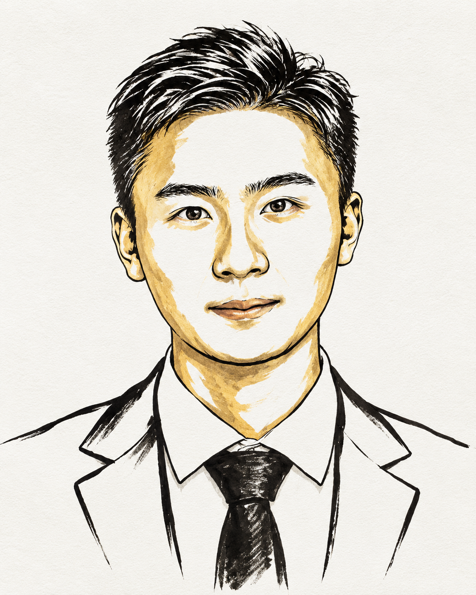
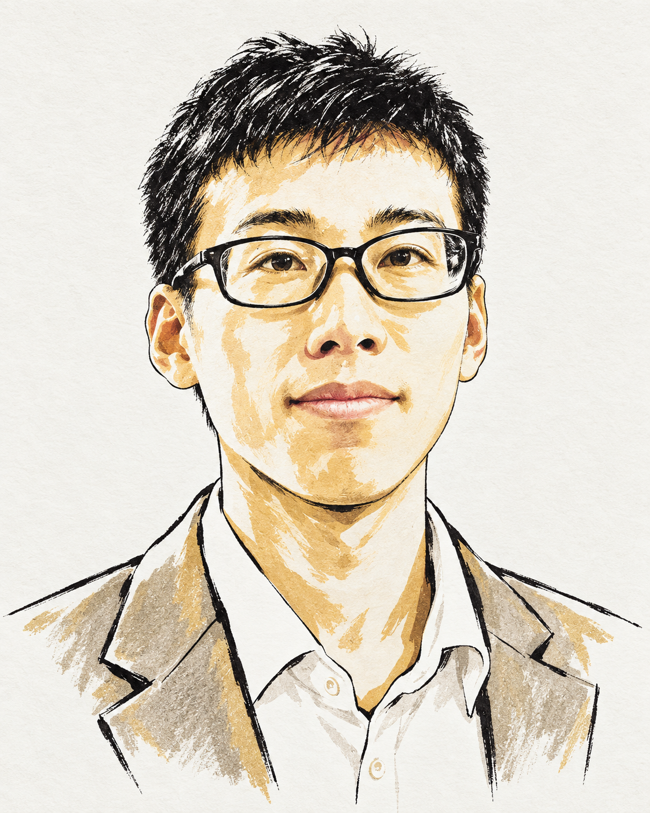

<div align="center">

# Nobel Prize Portrait

### 把一张人物照片，变成一幅墨线与金色交织的学者肖像。

An AI skill for expressive ink-and-gold academic portraits.

**黑色墨线 · 赭金点缀 · 暖白纸感 · 克制而有个性**

[效果展示](#gallery) · [快速开始](#quick-start) · [提示词示例](#prompts) · [安装说明](#installation)

</div>

---

**Nobel Prize Portrait** 是一个面向人物肖像创作的 AI Skill：上传一张照片，即可让支持图像生成的智能体，按诺贝尔奖公告肖像的视觉方向进行艺术化重绘。

它把人物识别、画风约束、表情调整和结果检查整理成可复用的创作流程。你可以保留更多本人特征，也可以让线条、发型和面部轮廓更具艺术表现力。

<a id="gallery"></a>

## 效果展示

下面两张图作为插件的实际输出展示，分别体现了不同的人物特征、发型处理和赭金色笔触表达。

| 输出示例 A | 输出示例 B |
| :---: | :---: |
|  |  |
| 更强调面部留白、轮廓线和黑色发丝 | 更强调眼镜、服装线稿和局部金色明暗 |

**示例来源：**以上两张图片由用户提供，用作 README 中的输出展示，不代表原技能包内置的固定输出。生成结果会随输入图片、提示词和模型变化。[查看示例提示词与素材说明](docs/example-prompts.md)。

## 你可以用它做什么

- **人物照片转插画**：将个人照片重绘为具有学术气质的编辑插画。
- **调整人物相似度**：在保留本人特征和更自由的艺术表达之间选择。
- **微调表情**：增加自然的闭嘴微笑，或一点克制的幽默感。
- **调整发型与轮廓**：让头发更蓬松、线条更松弛、人物更有个性。
- **结合风格参考**：同时提供人物照片和插画参考，分别指定“画谁”和“怎么画”。

适合个人头像、学术主页、人物介绍、纪念插画和创意展示。默认生成无文字肖像，便于后续自行排版。

<a id="quick-start"></a>

## 快速开始

在已加载本技能、且具备图像生成能力的环境中：

1. 上传一张脸部清晰的单人照片。
2. 输入下面的指令。
3. 查看结果，再补充需要调整的具体部位。

```text
使用 $nobel-prize-portrait，把这张照片画成诺贝尔奖公告风格的艺术肖像。
保留人物的主要特征，使用黑色墨线、少量赭金色和暖白纸张质感。
采用竖版半身构图，不添加文字、徽章或水印。
```

也可以直接用自然语言描述：

```text
把这张照片变成有学者气质的墨线金色肖像，
表情自然一点，带一点微笑，衣服和脸部多留白。
```

技能配置允许隐式调用；具体能否自动触发，取决于宿主环境。使用 `$nobel-prize-portrait` 显式点名更便于确认意图。

<a id="prompts"></a>

## 提示词示例

以下是可直接复制的用户指令，不是固定参数或命令行选项。

### 更像本人

```text
使用 $nobel-prize-portrait 处理这张照片。
尽量保留本人的五官、眼镜、发型和年龄特征，
以手绘黑色墨线和少量赭金色重绘，避免夸张变形。
保持温和、庄重的学者气质。
```

### 更有艺术感

```text
使用 $nobel-prize-portrait，把这张照片画得更有艺术表现力。
保留基本辨识度，允许适度调整脸部比例和发型。
线条更自由，头发更蓬松，额头、脸颊和衣服保留大面积暖白。
金色只作为少量点缀，不要画成照片滤镜效果。
```

### 带一点幽默感

```text
在刚才的肖像基础上，让嘴角轻轻上扬，眼神更温暖，
带一点安静的幽默感。保持闭嘴微笑，不要夸张大笑。
保留原来的墨线、赭金配色和人物特征。
```

### 同时使用照片与风格参考

```text
使用 $nobel-prize-portrait。
第一张图是要绘制的人物，第二张图只作为插画风格参考。
保留第一张图的人物特征，参考第二张图的线条、配色和留白。
不要复制参考图中的人物、文字、标志或签名。
```

## 默认视觉规范

| 维度 | 默认方向 |
| --- | --- |
| 构图 | 单人、居中、头肩肖像，竖版 4:5，边缘留白 |
| 背景 | 暖白或象牙白纸张，轻微纹理 |
| 线条 | 有粗细变化的黑色墨线，保留手绘感 |
| 配色 | 少量哑光赭金色，用于局部明暗与轮廓 |
| 人物 | 默认适度保留辨识度，可按要求提高或放宽 |
| 头发 | 分离的笔触与可见留白，可进行艺术化调整 |
| 服装 | 简洁勾勒领口、外套和领带，避免整片涂黑 |
| 表情 | 庄重自然；需要微笑时，以含蓄的闭嘴微笑为主 |
| 画面元素 | 默认不添加文字、姓名、标志、奖章、签名或水印 |

以上是生成时遵循的目标，不是对每次输出尺寸或细节的硬性保证。可通过后续指令修正偏差。

## 工作方式

1. **识别输入用途**：区分人物照片、风格参考和指定的编辑原图。
2. **检查人物与图片**：先查看本地图片；多人照片中目标不明确时，先询问画谁。
3. **选择保真程度**：根据“保留本人特征”或“更有艺术感”等要求调整表达。
4. **调用图像生成**：将人物信息与墨线、赭金、留白等规范组合成生成指令。
5. **检查并定向修正**：如果过于写实、阴影过重或像照片滤镜，进行一次有针对性的调整。

核心流程和完整风格模板定义在 `SKILL.md` 中。

<a id="installation"></a>

## 安装说明

### 运行前提

本项目提供的是 **Skill 指令包**，包含 `SKILL.md`、界面配置和图标。运行时需要宿主支持技能加载、图片输入，以及技能中使用的内置 `image_gen` 工具。图片生成由宿主提供，本仓库不包含模型权重、独立推理服务或 CLI 回退脚本。

### 在本地 Codex 中加载

将技能文件夹放入下列位置之一：

| 使用范围 | 技能主文件的位置 |
| --- | --- |
| 当前项目 | `<项目目录>/.agents/skills/nobel-prize-portrait/SKILL.md` |
| 当前用户 | `~/.agents/skills/nobel-prize-portrait/SKILL.md` |

例如，在包含 `SKILL.md`、`agents/` 和 `assets/` 的仓库根目录运行以下命令，可复制到用户技能目录。示例适用于 macOS / Linux；目标目录应为首次安装位置。

```bash
mkdir -p "$HOME/.agents/skills/nobel-prize-portrait"
cp SKILL.md "$HOME/.agents/skills/nobel-prize-portrait/"
cp -R agents assets "$HOME/.agents/skills/nobel-prize-portrait/"
```

Codex 会自动检测技能变化；如果没有出现，重启后再试。路径与发现机制参见 [OpenAI 官方技能文档](https://learn.chatgpt.com/docs/build-skills)。**成功发现技能后，仍需确认当前会话具备内置图像生成能力。**

### 在其他支持 Skills 的环境中使用

按宿主提供的技能导入方式加载文件夹，并确认其支持所需图像工具。原包中的产品声明不等于所有客户端均已验证可运行。当前提供的是技能目录结构，未包含插件商店发布清单。

## 文件说明

将本 README 和 `docs/` 放在原技能的根目录，与 `SKILL.md` 同级。

| 路径 | 用途 |
| --- | --- |
| `SKILL.md` | 原技能的触发描述、工作流程、视觉规范与提示词模板 |
| `agents/openai.yaml` | 原技能的展示名称、默认提示词与调用策略 |
| `assets/icon.svg` | 原技能图标 |
| `README.md` | 项目介绍与使用说明 |
| `docs/images/output-example-a.png` | 用户提供的输出展示图 A |
| `docs/images/output-example-b.png` | 用户提供的输出展示图 B |
| `docs/example-prompts.md` | 示例生成过程与完整提示词 |

README 使用仓库内的相对图片路径。上传 GitHub 时，请同时上传 `docs/`，并保留目录结构。

## 常见问题

**为什么没有生成图片，只给出了文字？**

先确认技能已加载，再确认当前环境有可用的图像生成工具。仅能读取 `SKILL.md` 的文本模型无法完成绘图。

**能保证每次都和本人完全一致吗？**

不能。默认允许艺术化重绘；如更重视相似度，请明确要求保留五官、眼镜、发型等特征，并提供清晰照片。

**生成结果太像照片，怎么办？**

要求减少皮肤细节与连续明暗，增加大面积留白，使用更稀疏、有粗细变化的墨线，简化头发和服装。

**可以直接做带姓名的海报吗？**

技能默认产出无文字肖像。可先生成肖像，再在排版工具中添加姓名、标题等信息。

---

<div align="center">

**一张照片，一点金色，一幅有个性的学者肖像。**

</div>
